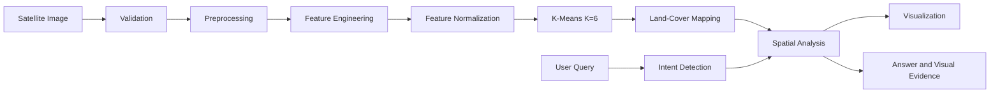

# SATQUERY AI — Talk to the Earth.

## What is SatQuery AI?
An explainable remote-sensing analysis prototype. Upload an RGB satellite/aerial image, ask questions in plain English, and get answers backed by highlighted pixels. A temporal module compares two images. Everything runs offline after installation (no API keys, no GPU).

**Not claimed:** no deep learning, no pretrained model, no VLM, no ground-truth accuracy, no NDVI/NDWI/NDBI on RGB.

## Architecture

## ML Method
Unsupervised **K-means (K=6, scikit-learn)** on z-score-normalised per-pixel features. Fitted on 15,000 sampled pixels, then all pixels get their nearest centroid. Confidence is the **cluster separation score** (nearest vs second-nearest centroid margin): a geometric measure, **not accuracy**.

## Feature Engineering (11 dimensions)
Red, Green, Blue, Excess Green (2G−R−B), Green−Blue, Red−Blue, HSV saturation, HSV value, local texture (Laplacian), edge density (Canny), local variance.

## Land-Cover Classification
Each cluster's mean raw-feature statistics are mapped to water / vegetation / built-up / bare land by rules (heuristic naming, not learned labels). Low-margin pixels and pure-black no-data pixels become *other*. Output is an **estimated land-cover composition**, never ground truth.

## Ask the Earth
Keyword intent router over the computed masks: where / how much / how many / largest / significant / dominant / overview / change. Each answer returns text, region count, largest region, compass location, share of scene, separation score, and a highlighted mask.

## Change Detection
ECC alignment, CIELAB difference with Otsu threshold (noise floor 20), morphology, small-blob removal. Per-region class transition is reported only if >=50% of the region's pixels agree; otherwise *VISUAL CHANGE DETECTED — SEMANTIC TRANSITION UNCERTAIN*. Reports total %, region count, largest region + location, mean difference.

## Real Satellite Imagery
No real imagery is bundled (redistribution licensing); `data/demo/` is **synthetic**. Get free true-colour exports from Copernicus Browser / EO Browser (Sentinel-2) or USGS EarthExplorer / EO Browser (Landsat 8/9), then upload the PNG/JPG. Do not scrape Google Earth. For change detection use the same place, similar season and sun angle.

## Supported Formats
PNG, JPG, JPEG, TIFF (8/16-bit RGB or single-band; 16-bit percentile-stretched). Multispectral TIFFs are rejected; **spectral indices are unavailable for RGB imagery** and are not computed. Max ~150 megapixels. A quality check warns on dark, low-contrast, near-black or near-white images and blocks blank ones.

## Limitations
Cluster-naming rules are heuristic and were developed on synthetic scenes plus sanity checks, not validated on labelled real satellite data. Shadows/dark roofs can be read as water; bare soil vs built-up is ambiguous in RGB; roads are not a class; change detection is sensitive to season/lighting; Q&A is a keyword router. No validation dataset is configured, so accuracy/precision/recall/F1 are not reported.

## Running Locally
```powershell
pip install -r requirements.txt
pip install -U streamlit      # needs >= 1.40
python data\make_demo.py      # optional, demo images included
streamlit run app\main.py
```
## Viva Explanation
"SatQuery AI is an explainable remote-sensing analysis prototype. It preprocesses satellite imagery, extracts engineered visual features, applies unsupervised K-means clustering to discover pixel groups, maps those groups to estimated land-cover classes, performs spatial connected-component analysis, and exposes the resulting visual evidence through natural-language queries. A temporal module compares two images to identify spatial changes."
